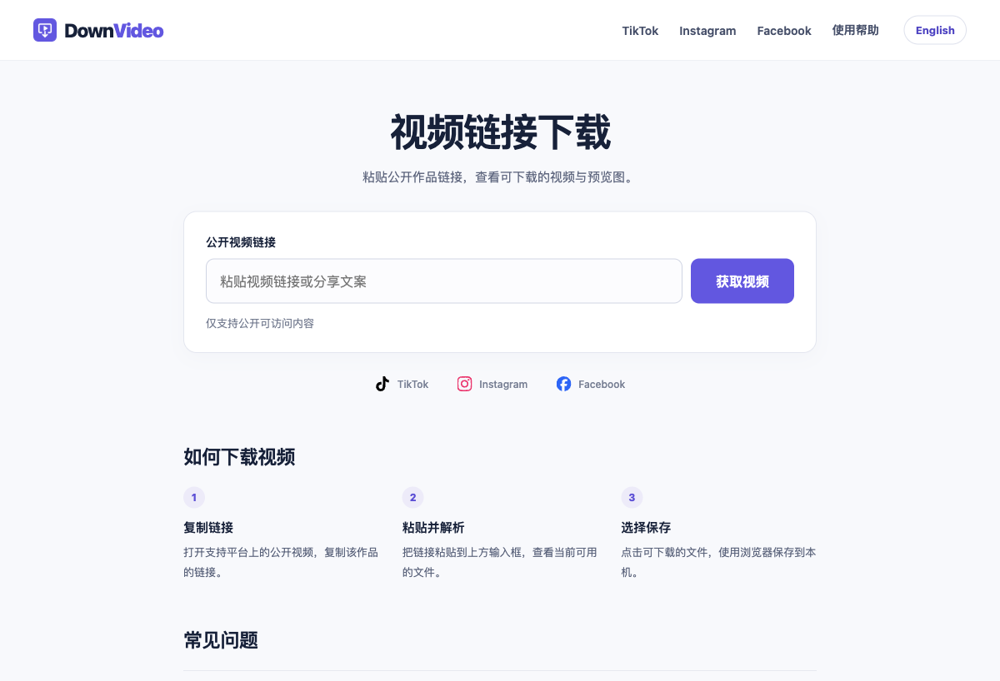

# DownVideo：双语视频下载工具的产品与 SEO 实践



> 产品类型：面向公开视频链接的中英文工具站<br>
> 项目阶段：已上线，继续验证下载稳定性与自然搜索表现<br>
> 工作范围：产品路径、双语 SEO、下载体验、Cloudflare 部署与数据追踪基础

[访问中文产品](https://downvideo.top/) · [English version](https://downvideo.top/en/) · [使用帮助](https://downvideo.top/zh-CN/help/)

DownVideo 让用户粘贴 TikTok、Instagram 或 Facebook 的公开作品链接，获取当前可用的视频文件，并在浏览器中保存。项目使用开源 cobalt 作为解析引擎，工作重点放在用户入口、下载状态、搜索页面和服务交付上。

## 项目目标与范围

这个项目围绕两个要求展开：让网站获得更多 SEO 入口，同时把下载过程做得清楚、可恢复。

首版覆盖中英文首页和三个平台的独立下载页。用户可以直接操作，不需要注册。预览图作为辅助信息，获取失败也应允许继续下载视频。YouTube 因当时的视频流验证未通过，没有纳入上线范围。

仅处理公开可访问、且用户有权保存的内容；私密内容、登录限制和平台访问策略会影响可用性。

## 项目工作

| 工作 | 具体交付 |
|---|---|
| 产品范围与信息架构 | 确定首版平台与语种，规划首页、平台页、帮助页和下载路径 |
| 用户体验 | 分享文案提取、解析取消、超时提示、重试、过期链接重新获取、浏览器保存兜底 |
| SEO | 双语静态页面、canonical、hreflang、Sitemap、结构化数据、图标及页面内链 |
| 服务交付 | Cloudflare Worker 与 Container 组合、文件流转发、签名下载链接、来源校验与限流 |
| 测量基础 | GTM 接入、GA4 收集验证、解析与下载事件定义、搜索站长平台配置 |
| 验收 | 页面与路由检查、自动化测试、历史公开视频样例的实际文件流验证 |

开发与验证使用 AI 辅助工具完成。cobalt 提供上游解析能力，DownVideo 的产品层与交付层负责把这项能力转化为可使用的网站。

## 用户路径：先拿到视频，再补充预览

```text
进入首页或平台页 → 粘贴链接 / 分享文案 → 获取视频结果 → 选择文件 → 浏览器保存
                                      ↘ 独立获取预览图
```

解析请求和预览图请求分开处理。服务端为视频解析设置 40 秒等待上限，预览图设置 6 秒等待上限，减少辅助信息拖住核心操作的情况。用户取消或重新提交后，旧请求不能覆盖新结果。

下载结果也需要说准确：

| 情况 | 页面反馈与处理 |
|---|---|
| 支持原生保存对话框，文件流写入完成 | 显示“文件已保存” |
| 使用浏览器普通下载 | 显示“已发起下载”，提示查看下载记录 |
| 用户取消保存 | 显示取消状态，不自动触发备用下载 |
| 下载链接过期或文件失效 | 保留原始来源，提供“重新获取下载” |
| 来源平台或解析服务暂时失败 | 给出可重试提示，区分超时、限流和无可用文件 |

签名下载链接有效期约 10 分钟。前端会先检查有效期，服务端再次验证签名与过期时间。视频文件通过流转发交付，cobalt 的原始 API 不直接对外开放。

## SEO：用平台页面承接具体任务

| 页面 | 中文路径 | 英文路径 |
|---|---|---|
| 首页 | `/` | `/en/` |
| TikTok 下载 | `/zh-CN/tiktok-video-downloader/` | `/en/tiktok-video-downloader/` |
| Instagram 下载 | `/zh-CN/instagram-video-downloader/` | `/en/instagram-video-downloader/` |
| Facebook 下载 | `/zh-CN/facebook-video-downloader/` | `/en/facebook-video-downloader/` |
| 使用帮助 | `/zh-CN/help/` | `/en/help/` |

每个平台页都能直接使用下载功能，并提供对应的步骤、限制和常见问题。Python 生成静态 HTML，让标题、正文和链接可以直接被抓取，减少多语种页面反复手工维护。

中文首页使用根路径作为 canonical；`/zh-CN/` 收敛到根路径，英文首页保留 `/en/`。不同语言配置互相对应的 hreflang，统一主域和已知页面别名，同时让不存在的页面返回 404。

2026-10-08 从线上 Sitemap 读取到 10 个 URL，包括两个首页、六个平台页和两个帮助页。页面与 Sitemap 可访问，是当前能确认的交付结果；排名、点击与自然搜索增长仍需要搜索平台数据。

## 测量：把解析成功与下载结果分开

前端使用 `downvideo_` 前缀的 dataLayer 事件，参数保留平台和错误类型，不把用户粘贴的完整作品链接作为事件参数。

| 事件 | 用途 |
|---|---|
| `downvideo_parse_success` | 观察解析是否产生可下载结果 |
| `downvideo_download_click` | 观察用户是否选择文件 |
| `downvideo_download_started` | 记录普通浏览器下载已发起 |
| `downvideo_download_success` | 记录原生保存流程写入完成 |
| `downvideo_download_error` | 定位下载失败环节 |

普通浏览器下载无法由页面确认最终完成，因此不能把“已发起”算作“已保存”。后续分析需要按保存方式分别看转化，并结合解析失败率、平台差异和重复使用判断体验。

历史配置中已接入 GTM，Google tag 收集请求曾返回 HTTP 204；GA4 Realtime、完整自定义事件接入和搜索平台处理状态仍需复核。这里展示测量设计与基础接入，不报告未经核验的漏斗转化率。

## 验证结果与仍待验证的部分

| 时间与范围 | 结果 | 说明 |
|---|---|---|
| 2026-10-08，线上页面检查 | 中英文首页、Sitemap、robots.txt 均返回 200 | 浏览器实测，两个首页的 canonical 与语言标识对应 |
| 2026-10-08，线上路由检查 | `/zh-CN/` 最终到中文根路径；不存在的页面返回 404 | 本次未重新验证全部主域与协议重定向 |
| 2026-10-08，本地现有工作目录 | 23 项自动化测试通过 | 包含未提交的改动；不等同于线上部署验收 |
| 2026-10-01，历史发布验证 | TikTok 样例解析成功，下载流返回 `video/mp4` 与 MP4 文件签名 | 仅证明该次样例；本次未重新测试视频解析与保存 |
| 早期产品验收 | Instagram、Facebook 公开样例曾返回可播放 MP4 | 上游策略与作品状态可能变化，需要持续抽样 |

自动化测试覆盖链接校验、路由、双语 SEO、超时、独立预览、过期下载、保存取消和旧请求防覆盖等场景。

目前没有在这篇案例中披露经过核验的自然流量、用户规模、收入或增长提升。后续重点是复核 GA4 事件、GSC 收录与搜索点击，并按平台观察真实解析和下载成功情况。

## 技术与运维

JavaScript · Python 静态页面生成 · Cloudflare Workers / Static Assets / Containers · cobalt · GTM / GA4

Worker 负责页面路由、来源校验、请求限流、签名链接和文件流；Container 运行上游 cobalt。部署需要单独执行 Cloudflare 发布流程，GitHub 推送本身不触发上线。Container 运行和网络出站存在用量成本，扩容前需要结合真实请求量与滥用情况判断。

代码仓库目前保持私有。本页公开项目方法、产品截图与验证边界。

---

[体验 DownVideo](https://downvideo.top/) · [返回作品集目录](../README.md)
