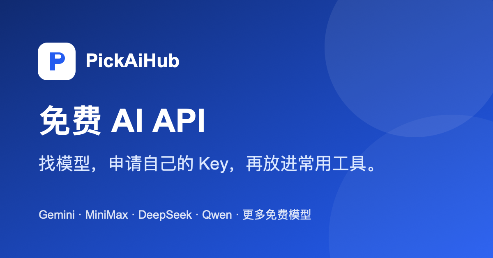

# PickAiHub：把免费模型搜索与个人统一 API 连接成一条 SEO 产品路径



> 项目状态：已上线，持续优化 SEO、模型目录与接入体验<br>
> 产品类型：面向中文用户的 AI 工具站 / SEO 获客产品<br>
> 核心方向：搜索意图承接、用户激活、BYOK 统一接入、数据与运营基建

[访问 PickAiHub](https://pickaihub.com/) · [浏览免费模型](https://pickaihub.com/#offers) · [查看代码仓库](https://github.com/The-AlexLiu/pickaihub)

## 一句话概括

PickAiHub 帮用户找到可以免费试用的 AI 模型，完成供应商账号申请，并把自己已经获得的模型能力统一接入常用 AI 工具。

这个项目并不把“免费额度”包装成平台承诺。它的核心是：用 SEO 承接“免费 AI API”“Gemini 免费 API”“DeepSeek API Key 怎么申请”这类真实搜索意图，然后帮助用户使用**自己的供应商账号与额度**完成接入。

## 项目背景

用户寻找免费模型时，通常会遇到三个连续问题：

1. **不知道选什么。** 模型、平台和能力很多，用户只知道想写内容、改代码、看图或做自动化。
2. **不知道去哪申请。** 即使找到模型，也不清楚免费层、试用条件、模型 ID 和平台入口。
3. **拿到 Key 后不会接入。** 不同供应商有不同的地址和模型名，用户在 Cline、编辑器或自己的项目中容易卡在配置环节。

常见目录站只解决第一步，接口中转站又常常引入付费、余额、信任和风控成本。PickAiHub 的产品取舍是：**不承担用户的模型体验成本，帮助用户整合自己已经申请到的能力。**

## 我负责的工作

- 产品定位、用户路径和 SEO 搜索意图设计；
- 模型目录、能力分类、热门排序和模型详情页信息架构；
- 供应商申请教程、配置 Prompt 与排错流程；
- Google 登录、个人工作台、统一 API Key 与多供应商连接体验；
- OpenAI-compatible API 路由、调用记录、密钥保护和失败处理；
- GA4、GSC、Sitemap、结构化数据、分享图和发布验收；
- Railway、Cloudflare、GitHub Actions 与生产运行基线。

## 核心用户路径

```text
搜索“免费 AI API”或具体模型
        ↓
按用途 / 开发者筛选，找到想用的模型
        ↓
阅读对应供应商的申请说明，使用自己的账号申请
        ↓
在 PickAiHub 连接供应商 Key，确认并启用模型
        ↓
复制统一 API 配置，粘贴到自己的 AI 工具中完成设置
        ↓
用最小请求验证调用，再持续管理模型与连接
```

### 1. 搜索页不堆砌模型，而是帮助用户做选择

目录支持按文本、视觉、图像、语音、嵌入、编程、工具调用和推理筛选，也可按 Google、MiniMax、DeepSeek、Qwen、OpenAI、Meta 等开发者查找。默认排序优先展示用户熟悉、搜索中常出现的模型，降低长尾模型挤占首屏的认知负担。

### 2. 详情页承接具体模型搜索词

热门模型有独立详情页，页面包含可做什么、对应供应商、接入入口和下一步操作。站点地图只纳入有限且有独立价值的热门模型页，避免为 156 个目录条目生成低质量重复页面。

### 3. 用“自己的账号”解决成本与信任问题

用户直接申请供应商账号；PickAiHub 不出售 Token，也不混用其他用户额度。连接后的 Key 在服务端加密保存，统一 API Key 只在创建时展示一次，前端和调用记录不回显供应商密钥。

### 4. 把配置阻力交给用户已经在使用的 AI 工具

控制台生成不含密钥的配置 Prompt。用户可以粘贴给 AI 编程工具或项目助手，让它先备份原配置、确认 OpenAI Chat Completions 兼容性，再由用户在安全字段填入自己的统一 Key。这样避免让普通用户手动理解每个客户端的环境变量和模型配置格式。

## 已完成的产品能力

| 能力 | 当前交付 |
|---|---|
| SEO 模型目录 | 156 个模型，可按能力、用途、开发者、平台和关键词筛选 |
| 搜索内容结构 | 24 个热门模型详情页、供应商申请教程、FAQ、Sitemap、JSON-LD 与分享图 |
| 身份与工作台 | Google 登录、邮箱密码登录、个人模型连接、调用记录与配置帮助 |
| 统一 API | OpenAI Chat Completions 兼容；一个统一 Key 对接用户已启用的个人模型 |
| 路由与保护 | 文本模型按优先级路由；明确 429 / 5xx 时可尝试下一连接；媒体与嵌入不做不透明回退 |
| 产品体验 | 控制台仅显示用户实际启用的能力；首次 Key 仅当前会话可见；失败与结果未知有明确提示 |
| 增长与可靠性 | GA4 事件、GSC、noindex 控制台、安全响应头、健康检查、GitHub Actions 与运行时冒烟验证 |

## 关键产品与增长决策

### 从“免费 Token”改为“帮助你免费用上模型”

用户搜索的是结果，不是平台内部的 Token 计算。首页文案、筛选结构和 CTA 都围绕“选模型、申请、开始用”组织；额度归属和条件放在清晰但不打断路径的位置说明。

### SEO 页面要有任务价值，而不是只有关键词

模型详情页连接到申请教程和控制台；供应商页解决申请与 API Key 获取；配置页解决接入阻力。每一类页面对应一个实际任务，避免通过模板批量制造相似页面。

### BYOK 先于统一调用

用户已经拥有供应商 Key 才会进入连接与启用流程。这样控制了平台成本边界，也让调用费用、免费资格和地区限制保持透明。平台不会将“添加 Key”误导为“已经验证可用”。

### 不提供超出用户模型能力的操作

控制台根据用户已启用模型的真实能力生成配置用途和测试选项。没有图像模型时，不展示文生图测试；媒体与嵌入调用要求精确模型 ID，避免 `auto` 将请求路由到不兼容模型。

## 数据与验证闭环

- **GA4：** 追踪模型筛选、模型详情进入、供应商教程、连接账号、启用模型、配置 Prompt、首次调用等关键事件。
- **GSC：** 观察搜索展示、索引覆盖、热门模型页与长尾词的承接效果；旧参数页通过 canonical 与 noindex 收敛。
- **应用验证：** 类型检查、128 项自动化测试、生产构建、运行时冒烟检查和 GitHub Actions。
- **生产验收：** HTTPS、控制台 noindex 与 no-store、公开页面缓存边界、健康检查及最小真实调用回归。

## 当前阶段与下一步

产品已完成从 SEO 落地页、模型发现、供应商申请到个人统一 API 的闭环。下一阶段重点是：

1. 基于 GSC 和 GA4 信号扩展有真实搜索意图的模型页与教程；
2. 建立供应商模型目录的定期校验与变更提示；
3. 将 SQLite 单实例演进为托管 PostgreSQL，提升备份、并发与扩容能力；
4. 补充错误追踪、服务监控和恢复演练，形成更完整的运营基建；
5. 在不改变 BYOK 成本边界的前提下，测试付费配置协助、团队工作区或高级路由等商业化方向。

## 技术与运营栈

TypeScript · Fastify · `node:sqlite` · OpenAI-compatible API · Railway · Cloudflare · Google OAuth · GA4 · GSC · GitHub Actions

---

[访问正式产品](https://pickaihub.com/) · [查看开发仓库](https://github.com/The-AlexLiu/pickaihub)
