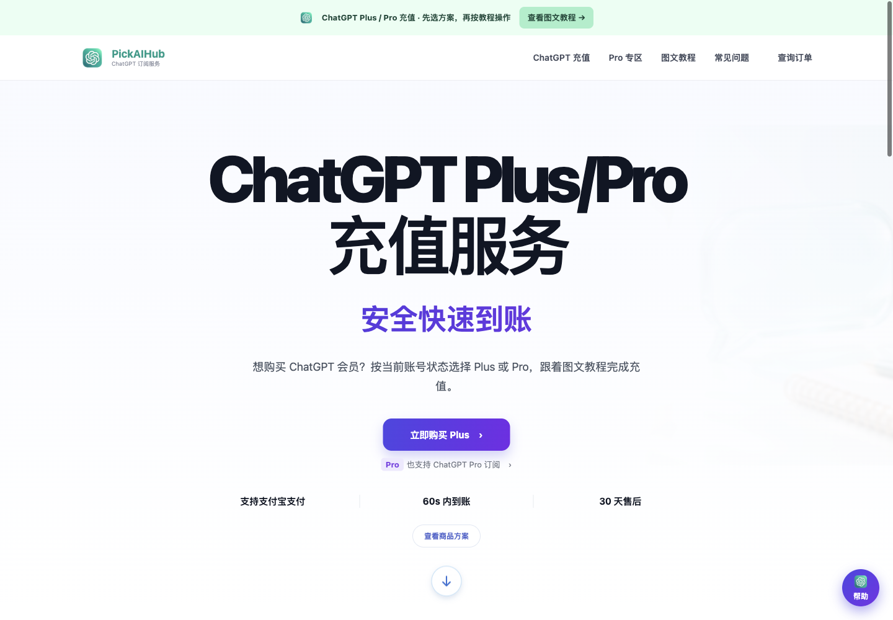
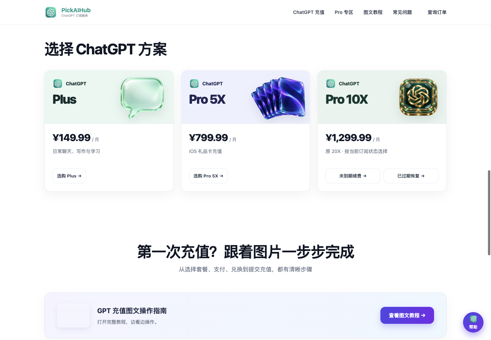
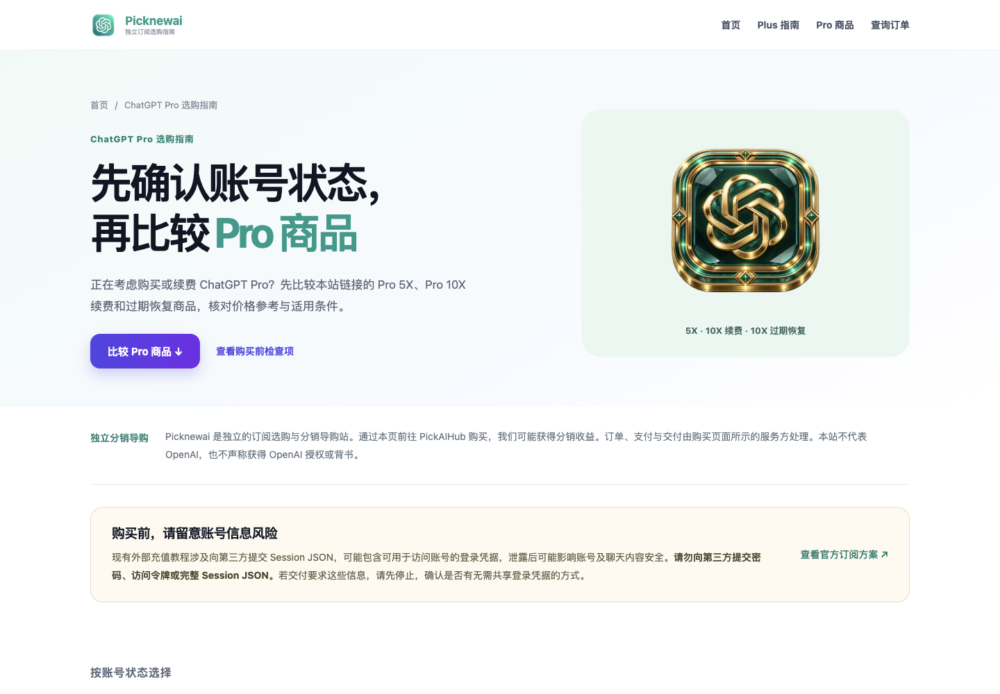
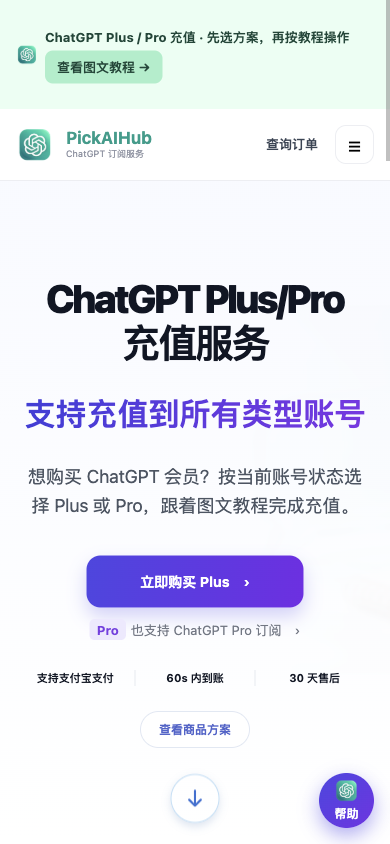

# PickNewAI：ChatGPT 订阅导购站的页面、SEO 与转化路径实践



> 产品类型：面向中文用户的 ChatGPT Plus / Pro 订阅选购与分销导购站<br>
> 项目阶段：已上线，继续核对购买路径与搜索表现<br>
> 工作范围：落地页、商品入口、中文 SEO、移动端体验、跨站 UTM 与点击追踪

[访问网站](https://picknewai.com/) · [Plus 充值说明](https://picknewai.com/chatgpt-plus-recharge/) · [Pro 选购指南](https://picknewai.com/chatgpt-pro/)

PickNewAI 把方案比较、账号状态、购买入口和帮助内容集中到一个中文站点。用户在 picknewai.com 阅读说明、选择商品，再前往 pickaihub.com 查看规格并进入购买流程。

本案例记录 PickNewAI 的订阅导购业务。作品集中另有 [PickAiHub 免费 AI API 案例](pickaihub.md)，两篇案例对应不同产品场景；这里不将 API 接入能力计入导购站的交付。

## 项目要解决的问题

购买订阅前，用户需要判断 Plus 与 Pro 的区别，也要确认自己的账号是否符合商品条件。Pro 的订阅期内续费和过期恢复使用不同入口，混在一起容易选错。

页面按这个判断顺序组织内容。首页提供 Plus 购买入口、Pro 导航、商品卡片和常见问题；Pro 指南进一步解释账号状态、商品条件和购买前检查项。图文教程、订单查询和售后入口贯穿这条路径。

## 项目工作与交付

| 工作 | 具体交付 |
|---|---|
| 页面与信息架构 | 桌面及移动端首页、Plus 说明页、Pro 指南页、分类 FAQ 与帮助入口 |
| 商品选择 | Plus、Pro 5X、Pro 10X 续费与过期恢复分别链接对应商品 |
| 购买引导 | 从页面内容进入商品详情，先核对规格与条件，再由商品方处理订单、支付和交付 |
| 中文 SEO | 独立说明页面、页面标题与描述、canonical、Sitemap、robots.txt 和站内链接 |
| 归因基础 | 商品及导航链接携带 UTM，按商品与按钮位置区分点击来源 |
| 发布维护 | 静态前端、版本化脚本、Cloudflare Pages 发布与线上页面核对 |

## 商品选择：把账号状态放到入口上



| 用户任务 | 页面提供的入口 | 购买前需要核对 |
|---|---|---|
| 查看 Plus | Plus 商品详情 | 规格、服务期限、交付方式与账号条件 |
| 比较 Pro 5X | Pro 5X 商品详情 | 礼品卡适用地区、兑换方式与订阅条件 |
| Pro 仍在订阅期内 | Pro 10X 续费 | 当前套餐、到期日、原订阅渠道与续费起止时间 |
| 此前订阅的 Pro 已到期 | Pro 10X 过期恢复 | 到期状态、恢复资格与商品适用条件 |

页面上的人民币价格用于选购参考，最终金额以对应商品页和结账页为准。截图保留了拍摄时的页面展示，不作为实时价格、库存或服务时效证明。

## SEO：让说明页承接具体搜索需求

首页负责整体选购，两个独立页面分别承接 Plus 充值说明与 Pro 方案比较。说明页保留购买入口，让搜索进入的用户在阅读条件后可以继续查看商品。

| 页面 | 路径 | 内容任务 |
|---|---|---|
| 首页 | `/` | 展示服务、方案和帮助入口 |
| Plus 说明 | `/chatgpt-plus-recharge/` | 解释价格参考、购买流程与订阅条件 |
| Pro 指南 | `/chatgpt-pro/` | 比较商品，区分续费与恢复，提供下单检查项 |

2026-10-08 线上 Sitemap 包含以上 3 个 URL，页面、Sitemap 和 robots.txt 均返回 HTTP 200。页面可以访问与搜索收录是两个结果，本案例未报告未经核验的排名、搜索点击或自然流量增长。



Pro 指南说明了独立分销关系、订单服务方和购买条件，并提供官方订阅入口。外部教程涉及账号信息时，页面提醒用户保护登录凭据。这些说明帮助用户判断交易条件，不能代替对实际交付流程的验证。

## 测量：区分商品点击与成交

```text
搜索 / 外部推荐 → PickNewAI 首页或说明页 → 选择商品
                                              ↓
                               PickAIHub 商品详情 → 规格确认 → 订单与支付
```

商品链接使用以下 UTM 字段。不同商品与页面位置使用不同的 campaign 和 content 值。

```text
utm_source=gpt_recharge_site
utm_medium=referral
utm_campaign=chatgpt_plus
utm_content=hero_plus
```

线上脚本将商品链接点击写入 dataLayer，事件名为 `checkout_click`，参数包括 `product_id`、`placement`、`target_domain` 和 `campaign`。虽然事件名带有 checkout，它记录的实际动作是前往商品详情，分析时应按商品出站点击理解。

本次核对确认首页加载 GTM / Google tag，点击脚本与线上链接的 UTM 已存在。GA4 是否收到完整事件、跨站来源是否保留，以及订单能否关联到入口，仍需通过真实报表与订单数据验证。这里不把脚本接入当作成交归因完成。

## 移动端与视觉呈现



移动端保留首屏购买按钮、Pro 入口和订单查询，导航收进菜单。配图采用商品视觉与教程图片，帮助用户区分方案和操作步骤。本次使用 1440 像素桌面视口与 390 像素移动视口检查并截图。

## 验证结果与后续工作

| 2026-10-08 核对范围（Asia/Shanghai） | 结果 |
|---|---|
| 首页、Plus 说明、Pro 指南 | 均返回 HTTP 200，页面正文可读取 |
| 桌面与移动端 | 完成线上截图，首屏购买及导航入口可见 |
| Sitemap 与 robots.txt | 均返回 HTTP 200，Sitemap 列出 3 个页面 |
| 商品入口 | 首页与 Pro 指南按商品和账号状态链接至 PickAIHub，携带 UTM |
| 追踪基础 | 首页加载 GTM / Google tag；线上脚本包含商品出站点击事件 |
| 支付、交付与经营数据 | 本次未执行真实购买；未核验 GMV、ROAS、成交率或实际到账时效 |

后续需要统一首页与 Pro 指南的品牌及服务表述，复核 GA4 点击事件与跨站订单归因，再结合 GSC 数据观察不同说明页的搜索表现。站点当前可访问，搜索增长和交易效果还需要持续验证。

## 技术与维护

HTML · CSS · JavaScript · Cloudflare Pages · GTM / Google tag · UTM / dataLayer

前端使用静态页面与 JavaScript 展示交互内容，商品、订单和支付由外部购买入口承接。发布使用 Cloudflare Pages Direct Upload；GitHub 内容更新与网站发布分别执行。本次只更新作品集案例和配图。

---

[体验 PickNewAI](https://picknewai.com/) · [返回作品集目录](../README.md)
